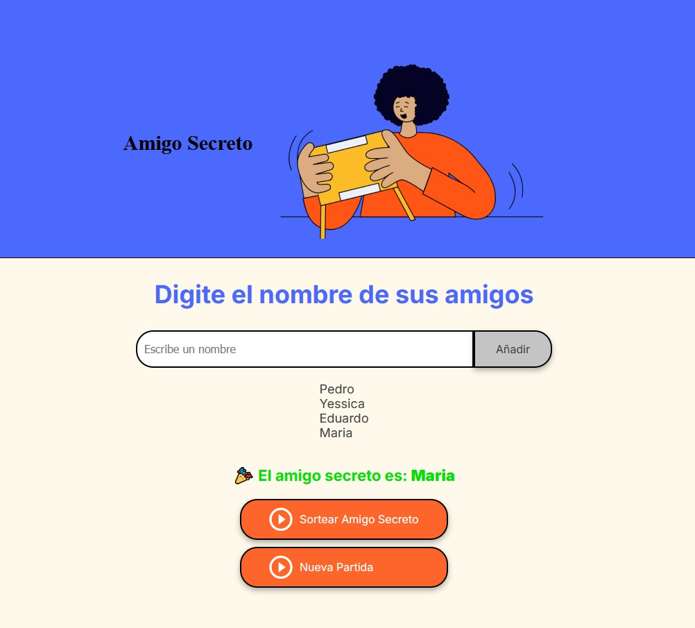

# 🎁 Amigo Secreto

Aplicación web sencilla para organizar y sortear el juego del **Amigo Secreto**.

## 🚀 Funcionalidades
- Agregar nombres de los participantes.  
- Mostrar la lista de amigos ingresados.  
- Realizar un sorteo aleatorio para elegir al Amigo Secreto.  
- Reiniciar la partida y comenzar un nuevo juego.  

## 🛠️ Tecnologías
- HTML5  
- CSS3  
- JavaScript 

## 📸 Vista previa

**Pantalla de inicio**  

  

**Resultado del sorteo**  

  

## ▶️ Uso
1. Escribe el nombre de cada participante en el campo de texto.  
2. Haz clic en el botón "Añadir" para agregar los nombres a la lista.  
3. Cuando tengas todos los nombres, presiona el botón "Sortear Amigo Secreto".  
4. Reinicia el juego con el botón "Nueva Partida" para volver a jugar.  

---
👨‍💻 Proyecto creado con fines prácticos y educativos.
